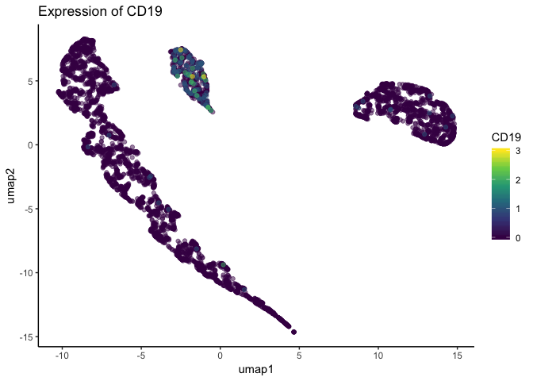
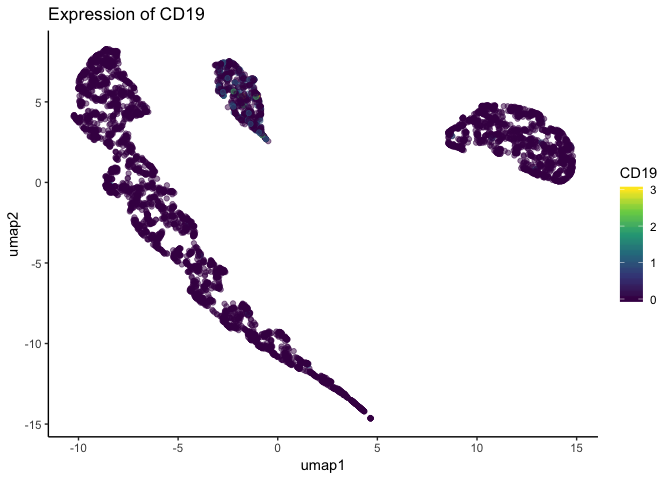

<!-- README.md is generated from README.Rmd. Please edit that file -->

```{r, include = FALSE}
knitr::opts_chunk$set(
    collapse = TRUE,
    comment = "#>",
    fig.path = "man/figures/README-",
    out.width = "100%"
)
```
# schex

<!-- badges: start -->
  [](https://bioconductor.org/packages/stats/bioc/schex)
  [](https://bioconductor.org/packages/stats/bioc/schex)
    [](https://codecov.io/gh/SaskiaFreytag/schex?branch=master)
<!-- badges: end -->


The goal of schex is to provide easy plotting of hexagon cell representations
of single cell data stored in `SingleCellExperiment` objects.

## Installation

You can install schex using the 
[Bioconductor project](https://bioconductor.org/):

``` r
# install.packages("BiocManager")
BiocManager::install("schex")
```

You can install the development version of schex with:

``` r
# install.packages("devtools")
devtools::install_github("SaskiaFreytag/schex")
```

## Why you need schex?

Did you know that the order in which points are plotted depends on their location
in the data frame? 
For example when plotting the expression of CD19, a B-cell maker, you may 
get the following three plots depending on how you order your observations.

{width=49%}
{width=49%}
{width=49%}

Using the first plot you would not decide to call the central cluster a B-cell 
population. Using the second plot you would probably decide to call the same 
cluster a B-cell population. Using the last plot you might be undecided.

## The solution

Instead of plotting points on top of each other, schex summarizes points into 
hexagon cells. Hence avoiding confusion due to observation order.

{width=49%}

Check out the vignettes to learn about how to get started. Or for a quick start,
use the following code.

```
library(TENxPBMCData)
library(scater)
tenx_pbmc3k <- TENxPBMCData(dataset = "pbmc3k")
rm_ind <- calculateAverage(tenx_pbmc3k) < 0.1
tenx_pbmc3k <- tenx_pbmc3k[!rm_ind, ]
tenx_pbmc3k <- logNormCounts(tenx_pbmc3k)
tenx_pbmc3k <- runPCA(tenx_pbmc3k)
tenx_pbmc3k <- make_hexbin(tenx_pbmc3k, 10, dimension_reduction = "PCA")
plot_hexbin_density(tenx_pbmc3k)
```

## On-the-fly hexbin computation

The package now computes hexagonal binning on-the-fly for any supported single-cell object using the new generic **get_hexbin_info()**. Highlights:

- **Generic dispatch**: `get_hexbin_info(object)` returns a list with `cID` and `hexbin.matrix`.
- **Supported classes**: Methods implemented for `SingleCellExperiment` and `Seurat` objects.
- **No metadata writes**: Internal extractors `.extract_cID` and `.extract_hexbin` compute bins at plotting time, so original objects remain unchanged.
- **SCUBA integration**: Uses SCUBA to read from additional object types.

You can now call any plot function directly on supported objects, for example:

```r
library(Seurat)
seurat_obj <- Load10X_Spatial("path/to/data")
seurat_obj <- RunUMAP(seurat_obj)
plot_hexbin_density(seurat_obj)
```

## Building and testing {#build-test}

To build and check the package locally from the terminal:
```bash
R CMD build .
R CMD check schex_*.tar.gz --as-cran
```

Alternatively, using **devtools** within R:
```r
# install.packages("devtools")
devtools::load_all()       # load all package functions
devtools::document()       # update documentation from roxygen comments
devtools::test()           # run unit tests (testthat)
devtools::check()          # run package checks
```

For Bioconductor compliance, you can also run:
```r
# install.packages("BiocManager")
BiocManager::install("BiocCheck")
BiocCheck::BiocCheck(".")
```

